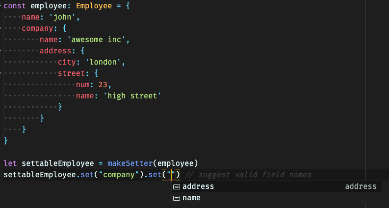
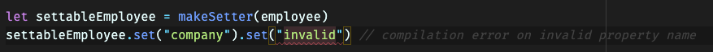

# Typescript property setter
Utility for mutating a deeply nested field of an object. Returns the modified
copy of the object instead of in-place mutation. Inspired by Functional Lenses.

##### Autocomplete on object properties

##### Compilation error on invalid property names
